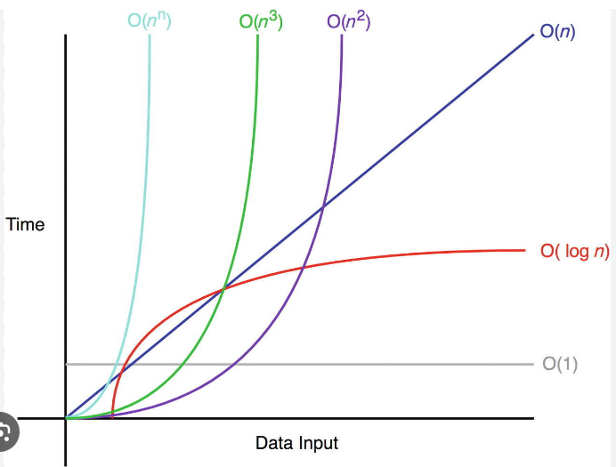
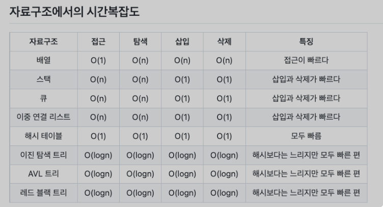
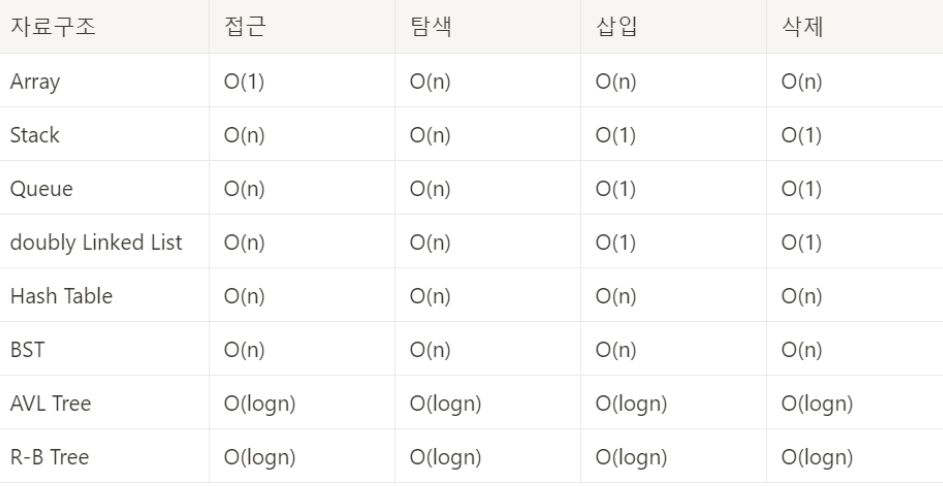

# 복잡도

## 1. 시간 복잡도
> - 입력 크기에 대해 어떠한 알고리즘이 실행되는 데 걸리는 시간
> - 보통 빅오 표기법으로 나타낸다.

 

### 빅오 표기법
> 입력 범위 n을 기준으로 로직이 몇 번 반복되는지 나타내는 것이다.

 

### 시간 복잡도의 속도 비교

 

### 자료 구조에서의 시간 복잡도
- 자료 구조의 평균 시간 복잡도
  

- 자료 구조 최악의 시간 복잡도

## 2. 공간 복잡도
> 프로그램을 실행시켰을 때 필요로 하는 자원 공간의 양을 의미
> 정적 변수로 선언된 것 말고도 동적으로 재귀적인 함수로 인해 공간을 계속해서 필요로 할 경우도 포함한다.