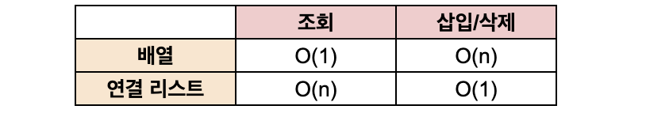

# 선형 자료 구조
> 요소가 일렬로 나열되어 있는 자료 구조

## 1. 연결 리스트
> 데이터를 감싼 노드를 포인터로 연결해서 공간적인 효율성을 극대화시킨 자료 구조

> - 탐색 : O(n)
> - 삽입 / 삭제 : O(1)

 

- prev 포인터와 next 포인터로 앞과 뒤의 노드를 연결시킨 것
- 맨 앞에 있는 노드를 헤드(head)라고 한다.

### 종류
1. 싱글 연결 리스트: next 포인터만 가진다.
2. 이중 연결 리스트: next 포인터와 prev 포인터를 가진다.
3. 원형 이중 연결 리스트: 이중 연결 리스트와 같지만 마지막 노드의 next 포인터가 헤드 노드를 가리킨다.

 

## 2. 배열

> - 크기가 정해져 있으며, 인접한 메모리 위치에 있는 데이터를 모아놓은 집합
> - 같은 타입의 변수들로 이루어져 있다.
> - 중복 O, 순서 O

### 랜덤 접근과 순차적 접근
- 랜덤 접근: 동일한 시간에 배열과 같은 순차적인 데이터가 있을 때 임의의 인덱스에 해당하는 데이터에 접근할 수 있는 기능 (순차적 접근과 반대)
- 순차적 접근: 데이터를 저장된 순서대로 검색해야 한다.

### 배열과 연결 리스트 비교

- 조회
  - 배열: 데이터에 즉시 접근 가능
  - 연결 리스트: 순차접근만 가능
   
- 삽입 / 삭제
  - 배열: 맨 마지막 위치에 데이터를 삽입/삭제하는 경우 시간 복잡도가 O(1)이지만 그 외에는 인덱스 조정을 위해 데이터 shifting이 일어나 O(n)의 시간이 걸린다.
  - 연결 리스트: 삽입/삭제 시 다음 노드의 주소 값만 바꿔주면 되기 때문에 O(1)의 시간이 걸리지만 삽입/삭제하려는 인덱스에 도달하기까지의 시간이 걸리기 때문에 실질적으로 O(n)의 시간이 걸린다고 할 수 있다. 
 

## 3. 벡터
> - 동적으로 요소를 할당할 수 있는 동적 배열
> - 중복 O, 순서 O, 랜덤 접근 가능
> - 탐색, 맨 뒤 요소 삭제/삽입 : O(1)
> - 맨 뒤가 아닌 요소를 삭제/삽입 : O(n) 

 

## 4. 스택
> - 가장 마지막으로 들어간 데이터가 가장 첫 번쨰로 나오는 성질(LIFO, Last In First Out)을 가진 자료 구조
> - 삽입/삭제 : O(1)
> - 탐색 : O(n)

 

## 5. 큐
> - 먼저 집어넣은 데이터가 먼저 나오는 성질(FIFO, First In First Out)을 지닌 자료 구조
> - 삽입/삭제 : O(1)
> - 탐색 : O(n)
> - CPU 작업을 기다리는 프로세스, 스레드 행렬 또는 네트워크 접속을 기다리는 행렬, 너비 우선 탐색, 캐시 등에 사용된다.